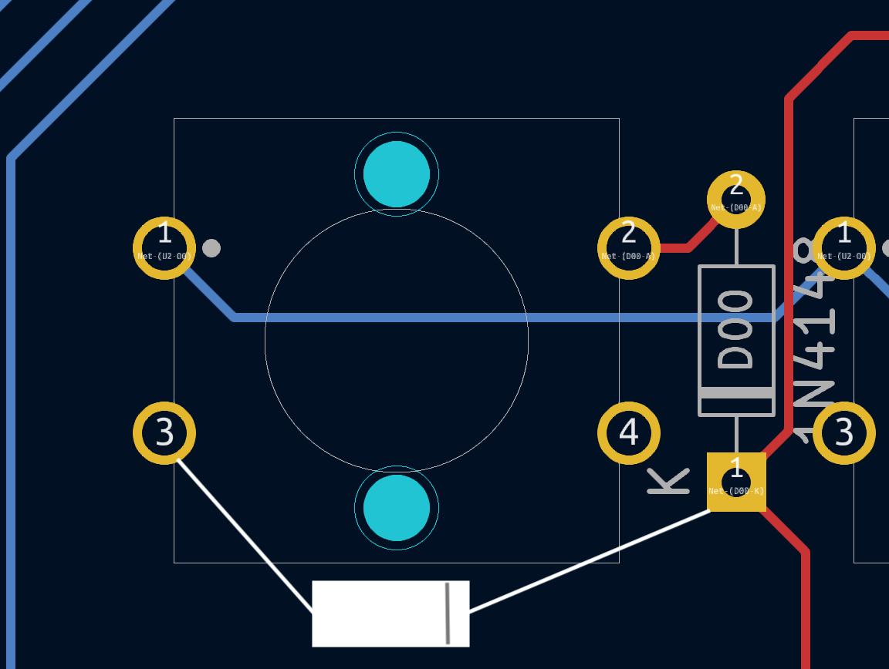
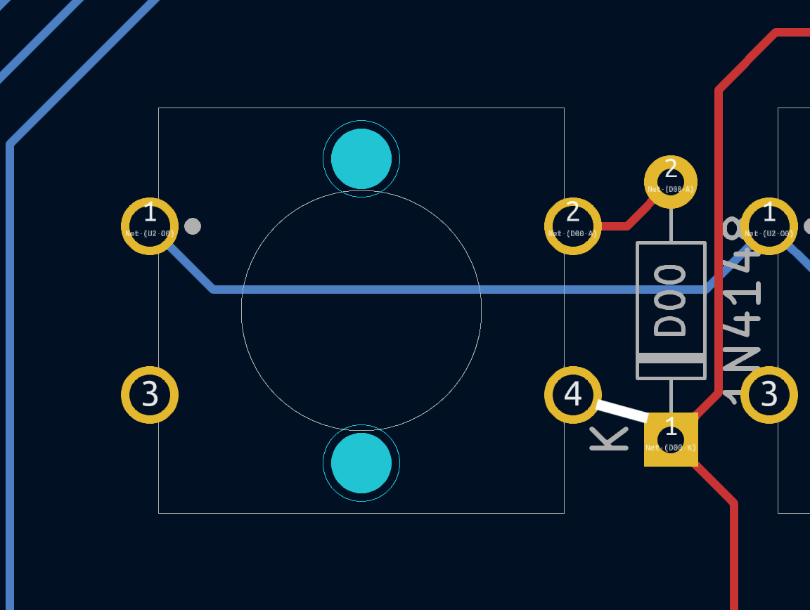

# BeanBoard
## QWERTY Keyboard and a simple LCD display for [BeanZee](https://github.com/PainfulDiodes/BeanZee)

**Status: evaluating first prototype**

***NOTE: There are significant issues with the current PCB layout requiring a workaround (described below) - use of the current layout is therefore not recommended***

This will be fixed in the next version.

# Prototype 

## Assembly Workaround

There is a problem with the switches on the PCB: On the schematic I originally used a generic SPST switch symbol (2-pins) and then later added a specific button footprint for the tactile switches I am using (4-pins).

There was an issue mapping the pins with the result that the PCB expects the switch to appear across pins 1 and 2, but the switch is connected across pins 1/2 and pins 3/4. Pins 1 and 2 of the switch are connected together and pins 3 and 4 are also connected. The result of this is that if the PCB is assembled as per the diagrams and silk screen layout, then all the switches will act as permanently closed.

The workaround for this is instead of fitting the diodes as per the layout, solder the diodes on the rear of the board between pin 3 of the switch and the pad which indicates the cathode of the diode (diode shown in white):

In order to quickly continue evaluating the board, I have adopted a simpler workaround - use a wire link in place of a diode, between pin 4 of the switch and the diode cathode pad:

## Testing and Observations

I have successfully loaded and run some test programs which show the keyboard and LCD display are working as expected.

The buttons are laid out as a full-sized keyboard, but I am using low-csot tactile switches. This now seems wrong to me: 

If I am using a full-sized layout then I should use Cherry MX style keys/keycaps.  

But if I want to have a small experimental device for single-finger typing then the standard smaller tactile buttons on a smaller layout would be better. 

What I have currently sits between these two designs and isn't satisfying. 

There's a lot of empty space in any case; I could move the logic chips underneath the BeanZee piggyback board. 

The LCD may need to be angled to read easily, but this might be solved just by making the board smaller.

Separating the GPIO connectors and power (4 separate sockets) seems flimsy. I also should consider whether there are standard configurations for connectors - e.g. RPi GPIO.

It would be nice to continue to use the system powered by a battery, especially if something is plugged into the GPIO.
    
## Gallery

Note that in the image diodes are fitted as per the silk-screen printing. As per the notes above, this does not work. I removed the diodes and replaced them with links to allow the keys to function.

  

  

# Design

## Keyboard  
Aiming for the simplest possible design, using a simple matrix of switches. 

Diodes are used with each switch to prevent [ghosting](https://en.wikipedia.org/wiki/Key_rollover#Key_jamming_and_ghosting).  

The circuit expects the CPU to send a "strobe" - output to a defined port. A latch is used to capture the strobe - so that the state persists after the CPU has stopped outputting to the port. This strobe should have only one bit set high. This is the "live" row.

Then the CPU will read from a defined port to sense which columns are high - activated by switches being pressed. A buffer is used to gate the rows onto the data bus.

The CPU will loop back and successively set each strobe bit high. Having gone through each bit and then read back the columns, we will have 64 bits of data (8x8) representing which keys are being pressed.

## LCD
The [Hitachi HD44780 LCD controller](https://en.wikipedia.org/wiki/Hitachi_HD44780_LCD_controller) has been around since the 1980's and is still popular to control character-based LCD displays:  
* [HD44780 datasheet](https://cdn-shop.adafruit.com/datasheets/HD44780.pdf)   
* [Adafruit Standard LCD 20x4](https://www.adafruit.com/product/198)  

A parallel interface makes it CPU bus friendly - with 8 data bits, enable, R/W and register select inputs.

## GPIO

As an afterthought, repeating the keyboard logic allows for 8 general purpose binary outputs and inputs which can be used for experimentation.

## Port address decoding

A couple of options were considered: [PortDecoding.pdf](/kicad/PortDecoding/PortDecoding.pdf), and the simpler was selected.

A 3 to 8 decoder has been used to select pairs of ports. A0 is then used to chose between ports in a pair. The BeanZee board has the logic to separate ports based on A0, and there's a similar arrangement here for LCD. The keyboard ignores A0.

KBD_PORT equ 2 ; or 3  
LCD_CTRL equ 4 ; LCD control port  
LCD_DATA equ 5 ; LCD data port  
GPIO equ 6 ; or 7  

## Schematic etc
[BeanBoard Schematic](/kicad/BeanBoard.pdf)  
[Key groups](keygroups.txt)  
