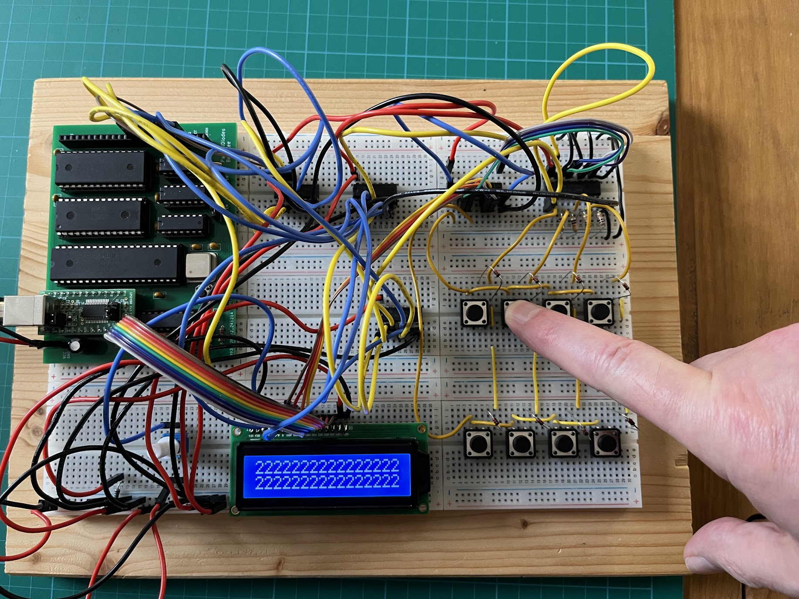
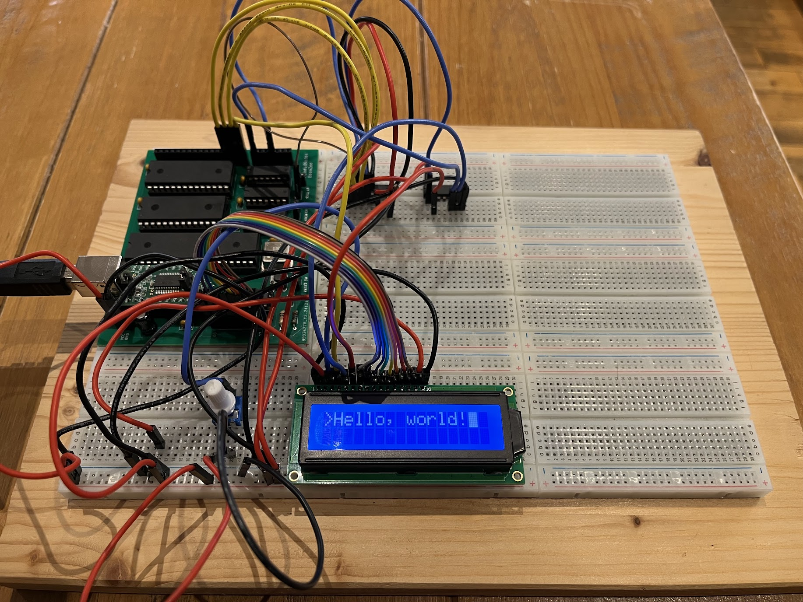

# BeanBoard
## QWERTY Keyboard and a simple LCD display for [BeanZee](https://github.com/PainfulDiodes/BeanZee)

This is a work in progress...  

[Schematic](/kicad/BeanBoard.pdf)  

Currently I am testing out a first PCB prototype. 

There is a significant problem with the switches on the PCB: On the schematic I originally used a generic SPST switch symbol (2-pins) and then later added a specific button footprint for the switches I am using (4-pins). I realise now that I should have replaced the switch symbols on the schematic, which would have made the 4 pins explicit. As it is, the pairs of pins for the switches I am using on the PCB all are shorted. By removing the diodes I can patch the matrix to work - by connecting an unconnected pin to where the diode used to be. Unfortunate, and I will need to change the PCB in the next version, but I can now continue to evaluate the design. 

I have loaded and run some test programs which show the circuit is working as expected. 

## Observations

The buttons are laid out as a full-sized keyboard, but I am using cheap tactile switches. This now seems wrong to me - if I am using a full-sized layout then I should use proper MX keys/keycaps. 

But if I want to have a small experimental device for single-finger typing then the standard smaller tactile buttons on a smaller layout would be good. 

What I have currently sits between the two concepts and isn't satisfying. 

If I do opt for a small design, then I'd shrink it as small as I can; I could move the logic underneath the BeanZee piggyback board. 

The LCD may need to be angled to read easily, but this too may be solved just by making the board smaller.

Separating the GPIO connectors and power (4 separate sockets) seems flimsy. I also should consider whether there are standard configurations for connectors - e.g. RPi GPIO.

Battery... I need to think about what happens when you unplug the USB. Would be nice to continue to use the system from a battery, especially with something plugged into the GPIO.
    
# Gallery

  

  

## Keyboard  
Aiming for the simplest possible design, using a simple matrix of switches. 

Diodes are used with each switch to prevent "[ghosting](https://en.wikipedia.org/wiki/Key_rollover#Key_jamming_and_ghosting)".  

The circuit expects the CPU to send a "strobe" - output to a defined port. A latch is used to capture the strobe - so that the state persists after the CPU has stopped outputting to the port. This strobe should have only one bit set high. This is the "live" row.

Then the CPU will read from a defined port to sense which columns are high - activated by switches being pressed. A buffer is used to gate the rows onto the data bus.

The CPU will loop back and successively set each strobe bit high. Having gone through each bit and then read back the columns, we will have 64 bits of data (8x8) representing which keys are being pressed.

## LCD
The [Hitachi HD44780 LCD controller](https://en.wikipedia.org/wiki/Hitachi_HD44780_LCD_controller) has been around since the 1980's and is still popular to control character-based LCD displays:  
[HD44780 datasheet](https://cdn-shop.adafruit.com/datasheets/HD44780.pdf)   
[Adafruit Standard LCD 20x4](https://www.adafruit.com/product/198)  
A parallel interface makes it CPU bus friendly - with 8 data bits, enable, R/W and register select inputs.

## GPIO

As an afterthought, repeating the keyboard logic allows for 8 general purpose binary outputs and inputs which can be used for experimentation.

## Port address decoding

A couple of options were considered: [PortDecoding.pdf](/kicad/PortDecoding/PortDecoding.pdf), and the simpler was selected.

A 3 to 8 decoder has been used to select pairs of ports. A0 is then used to chose between ports in a pair. The BeanZee board has the logic to separate ports based on A0, and there's a similar arrangement here for LCD. The keyboard ignores A0.

KBD_PORT equ 2 ; or 3  
LCD_CTRL equ 4 ; LCD control port  
LCD_DATA equ 5 ; LCD data port  
GPIO equ 6 ; or 7  